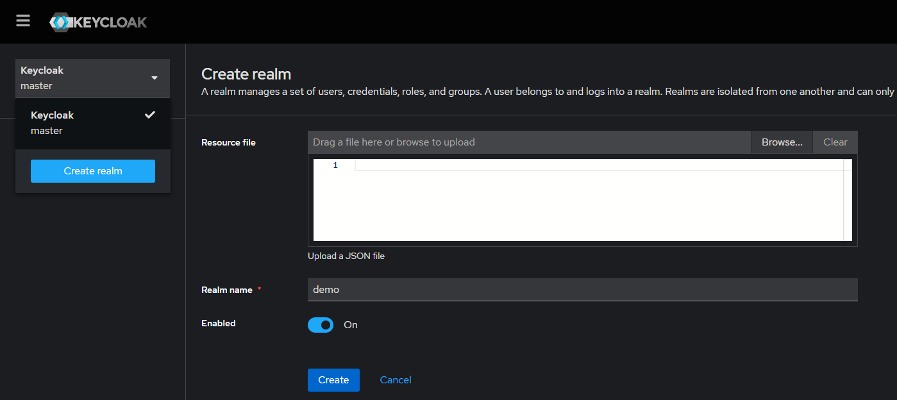
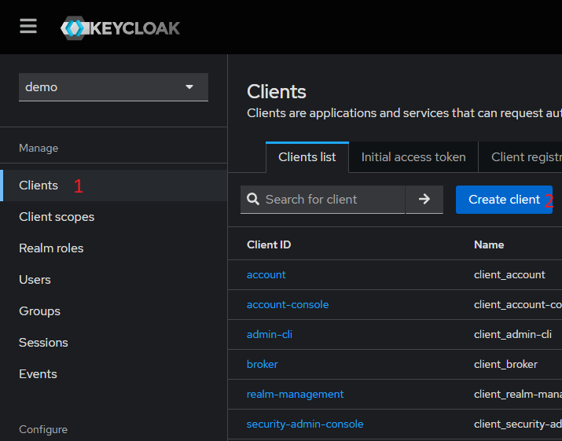

# Local Setup

### Please make sure to configure `keycloak` and `postgres` before `postgrest`

## 1. Postgres setup

Start postgres container by running

```sh
docker-compose up -d postgres
```

Create table & roles for your postgres by running the `postgres.sql` file in the `setup` directory. It will create a dummy todolist table with contents and configure appropriate roles.

## 2. Keycloak setup

Start postgres container by running

```sh
docker-compose up -d keycloak
```

1. Login to keycloak which is at `http://localhost:8080/`
2. Login where the default username is `admin` and password being `adminpassword`. Feel free to change it in the `docker-compose.yml` file
3. Create a new realm (top left button) and name it `demo`
   

4. Create a new client called `nextjs`
   

   - Name the `Client ID` nextjs and go next step
   - Enable `Client authentication`, `Standard flow`, and `Direct access grants` then go to next step
   - Set `Valid redirect URIs` to `http://localhost:3000/*` and save
   - Once created, go to the **Credentails tab** and save the `Client Secret`

5. Create realm role and client role

   **`Client Role`**: Go to your newly created `nextjs` client, select the `Roles` tab and create a new role called `admin`

   **`Realm Role`**: Go to `Realm roles` section on the left and create a new role called `admin`

6. Create a user by going to the `Users` section and follow the steps. Make sure to assign a password by going to credentials after creation and setup the password

   **`Assign Role`**: Go to `Realm mapping` tab within your newly created user details. Click on **Assign role** and select `nextjs admin`. Click on **Assign role** again and change filter to **by realm roles** and select the admin

   **`Test Login`**:

   1. Go to `/doc/api.rest` file and replace the `kc_client_secret` value with the `client secret from above`
   2. GO to line 48 and send the request after matching the username and password to your user

## 3. Postrest setup

Before we start the postgrest container, we need to generate the `jwk` key for it.

**JWK Setup**

1. Go to your keycloak, make sure its the demo realm, then go to the `Realm settings`.
2. Navigate to the `Keys` section and copy the `RSA256 Public Key`
3. Go to https://8gwifi.org/jwkconvertfunctions.jsp, set it to `PEM-to-JWK`
4. Insert **-----BEGIN PUBLIC KEY-----** at the start
5. Paste the `RSA256 Public Key` afterwards
6. Insert **-----END PUBLIC KEY-----** at the end
7. Make sure that there are spaces between begin/end key then click on submit
8. Save the generated keys and paste it into the `PGRST_JWT_SECRET` value in the `docker-compose.yml` file on line 11

Start the postgrest container

```sh
docker-compose up -d postgrest
```

## 4. Start nextjs app

- Install the require dependencies by running

```sh
npm run i
```

- Configure environment variables

  1. Copy .sample.env and make a new file called .env
  2. Set the `KEYCLOAK_CLIENT_ID` value to `nextjs`
  3. Set the `KEYCLOAK_SECRET` value to the `Client Secret` from aboves

- Run the nextjs application by running

  ```sh
  npm run dev
  ```

  afterwards navigate to `http://localhost:3000/`

- Test login by clicking on Login and fill in your creds
- Test postgrest by going to http://localhost:3000/admin and play around
